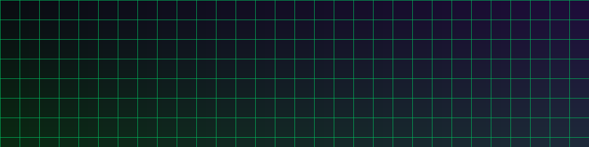

## Selamat datang

Kalau kamu bisa membaca ini, berarti blog Hugo + PaperMod sudah berhasil di-deploy. 🎉

Post ini adalah **page bundle**: satu folder berisi `index.md` + folder `images/`. Ini pola yang
dipakai untuk semua artikel supaya rapi — gambar nempel ke artikelnya.

## Contoh embed gambar

Gambar disimpan di `images/` lalu dipanggil dengan path relatif:



Markdown-nya cukup: ``

## Contoh code block

Blok kode punya tombol **copy** dan syntax highlighting:

```bash
# recon dasar
nmap -sV -p- --min-rate 5000 target.example.com
```

```python
import requests
r = requests.get("https://target/api", timeout=5)
print(r.status_code)
```

## Contoh tabel

| Fase        | Tool                 | Tujuan                  |
|-------------|----------------------|-------------------------|
| Recon       | nmap, amass          | Petakan attack surface  |
| Exploit     | metasploit, custom   | Dapatkan akses awal     |
| Post-exp    | mimikatz, bloodhound | Eskalasi & lateral      |

## Catatan

> Semua konten di blog ini untuk edukasi dan pengujian keamanan yang sah.

Selamat menulis!
